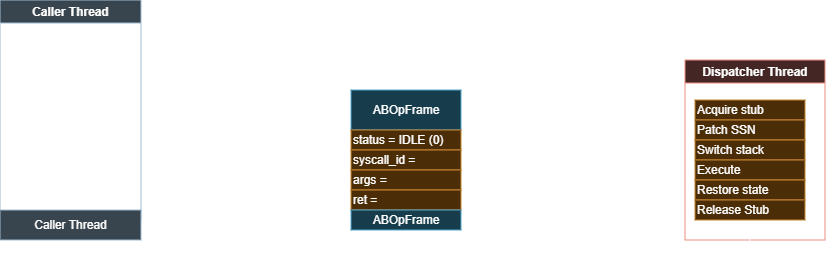

$NAME "ActiveBreach Engine: Rethinking Syscall Execution Under EDR"
$DATE 05-02-2026
$TAGS "hooks, windows"
$AUTHOR "8damon"
$PREVIEW "Modern defensive tooling doesn’t need to see payloads to stop you, it only needs to see the call path. This post breaks down how Windows system calls are intercepted, how syscall stubs became signatures, and why ActiveBreach takes a fundamentally different approach."

## Thesis

Windows APIs route through multiple layers. Advanced defensive products intercept calls routing through these layers as part of their instrumentation. This is a problem for any red-team engagement and can end it before it even begins.

There wasn't a real framework that was maintainable, secure, and easy to use; that gap gave me the idea for **ActiveBreach**, AKA **ABE**.

In this post, we'll dive into how I developed **ABE** and how Windows handles **System Calls**.

This article is about the **Rust implementation** of ActiveBreach Engine, which is currently the most mature and feature-complete version in the SDK.

ActiveBreach Engine project: [github.com/8damon/ActiveBreach-Engine](https://github.com/8damon/ActiveBreach-Engine)

The SDK also includes C and C++ variants, but the Rust version is the most advanced and actively developed, which is why it is the focus here.

---

## The Problem

Suppose you want to write memory to a remote process in a protected environment.

Unfortunately, your first detection happens before you even get to write any memory: the `OpenProcess` call.

The EDR sees an all-access handle opened to Chrome and can escalate or terminate the process before post-exploitation even starts.

### Exploring the Call Chain

Let's see what just happened under the hood.

```
HANDLE hProcess = OpenProcess(
    PROCESS_ALL_ACCESS, // accessRights
    FALSE, // inherited
    ProcessID // PID
);
```

We'll break on this call to observe it in disassembly.

```asm
HANDLE hProcess = OpenProcess(
mov         r8d,dword ptr [rbp+0A8h]  
xor         edx,edx  
mov         ecx,1FFFFFh ; PROCESS_ALL_ACCESS
call        qword ptr [__imp_OpenProcess] ; IAT  
mov         qword ptr [hProcess],rax
```

We can see that **OpenProcess** calls ``__imp_OpenProcess``; let's follow that.

Okay, now we're inside of `KernelBase.dll!OpenProcess`.

Why are we here? Well, when you include `<Windows.h>`, each API you use (in this case, `OpenProcess`) links to a system DLL. The **Import Address Table** (IAT) on process-load will then route your `call` to `OpenProcess` to `KernelBase.dll!OpenProcess`, *(! signifies it is an exported entry)*

Now `KernelBase` is going to add some extra attributes to your call before forwarding it to `ntdll.dll`, we don't care about this so I've excluded it.

```asm
@KernelBase.dll
mov         r11,rsp  
sub         rsp,68h  
xor         r9d,r9d  
movsxd      rax,r8d  
...
movdqu      xmmword ptr [rsp+50h],xmm0  
call        qword ptr [__imp_NtOpenProcess] ; fwd to ntdll!NtOpenProcess
nop         dword ptr [rax+rax]  
...
int         3  
```

### Hook Land and the Importance of ntdll.dll

Now we're in hook land. In this example there's no hook; this is the generic Syscall Prologue/System Call Stub. The key part is the `syscall` instruction. On modern x64 Windows, syscall gateway stubs are primarily exposed through `ntdll.dll` (NT syscalls) and `win32u.dll` (Win32k/GDI/USER syscalls). In WOW64 processes, execution also transitions through `wow64.dll`, `wow64win.dll`, and `wow64cpu.dll`.

Any function that starts with `Nt` in the Windows API is part of the "Native API", which is largely undocumented and acts as the entry point to the kernel from user mode.

The point is that any function that ultimately executes kernel code has an underlying `Nt` function. In this case, `OpenProcess` requires the kernel, so it is routed down into `NtOpenProcess`.

```asm
@ntdll.dll
mov         r10,rcx ; preserve RCX for return NTSTATUS
mov         eax,26h ; loads syscall number (26h) into EAX
test        byte ptr [7FFE0308h],1  ; check fallback bit (KUSER_SHARED_DATA+0x308) 
jne         NtOpenProcess+15h   
syscall     ; context-switch to kernel-mode
ret  
int         2Eh ; uses this execution path if legacy
ret  
```

Why not provide the `Nt` API upfront? Many `Nt` calls require extra parameters and undocumented structures that are automatically populated by higher-level routines (e.g., `KernelBase.dll!OpenProcess` populates the structures required by `ntdll.dll!NtOpenProcess`).

### What Defensive Products Hook

Now if you've been keeping up, you can see a perfect opportunity here for a defensive product (such as an EDR) to hook the `Nt` call instead of the higher-level API. There's more reason for this too: system call stubs all follow the exact same layout, so hooks do not need to be specialized for each function, and they're convenient and centralized.

This would be the most generic type of hook;

```
@ntdll.dll
jmp     qword ptr [rip+EDR.dll+instrument_func]   ; jump to EDR instrument
nop ; no-op
nop
nop
nop
nop
```

I won't delve into the other hook variants here because they are outside the scope of this post; ABE's execution model is designed to avoid relying on those instrumented user-mode entry paths.

---

## The First Evolution: Syscall Stubs

A **System Call Stub** (shown earlier) is the stub used by the operating system to execute a **System Call**, these calls are numbered by something called the **System Service Number** (SSN), with the SSN to a relevant `syscall` a user in theory can execute any **System Call** they want.

A Syscall stub can be created in your program with a function as simple as:

```c
VOID* CREATE_SYSCALL_STUB(uint32_t SSN) {

    uint8_t stub[] = {
        0x4C, 0x8B, 0xD1,             // mov r10, rcx
        0xB8,                         // mov eax, imm32
        0x00, 0x00, 0x00, 0x00,       // SSN placeholder
        0x0F, 0x05,                   // syscall
        0xC3                          // ret
    };

    *(uint32_t*)(stub + 4) = SSN;

    VOID* mem = VirtualAlloc(
        NULL,
        sizeof(stub),
        MEM_COMMIT | MEM_RESERVE, PAGE_EXECUTE_READWRITE
    );

    if (!mem) return NULL;

    memcpy(mem, stub, sizeof(stub));

    DWORD old;

    VirtualProtect(mem, sizeof(stub), PAGE_EXECUTE_READ, &old);

    return mem;
}
```

This is what tools such as SysWhispers and Hell's Gate do, more specifically:

* **SysWhispers** popularized a practical approach: generate syscall stubs ahead of time and call them directly, bypassing the normal API path through `ntdll.dll`.
* **Hell’s Gate** and related techniques pushed the idea further by resolving syscall metadata dynamically at runtime, improving resilience across builds and reducing the brittleness of purely static approaches.

### Detecting Syscall Stubs

Syscall stubs are fragile by themselves. The syscall prologue is extremely unique, and the `syscall` instruction residing outside of `ntdll.dll`, especially within private memory, is a huge red flag for an EDR.

Soon defensive products integrated static scans into their smart screens that check for the `syscall` instruction and syscall prologues, detecting SysWhispers and similar tools alike. Defensive products also implemented runtime memory checks using similar rules for detecting syscall stubs in memory, leading to tools that dynamically generated stubs being suspected as well.

The simplest form of this rule can be broken down to:

if `mov r10, rcx` and `syscall; ret` appear in private memory, or if the memory region is not `ntdll.dll`: flag.

Or more literally:

```
rule Winx64_SYSCALL_STUB
{
    strings:
        $syscall_stub = {
            4C 8B D1            ; mov r10, rcx
            B8 ?? ?? ?? ??      ; mov eax, SSN
            0F 05               ; syscall
            C3                  ; ret
        }
}
```

## ABE's Approach

Adversary tooling had to evolve. **ABE** therefore adopted a design model more commonly seen in anti-cheat and DRM systems, centered around **stub encryption** and **build-time obfuscation**.

Rather than embedding syscall prologues directly in the binary, ABE uses **Rust build-time code generation** to transform the syscall stub bytes *before* compilation. These bytes are encrypted during the build step and only materialized at runtime by the stub generation logic. As a result, the compiler never observes plaintext syscall opcodes, and no static artifacts are present on disk.

To address live memory inspection and heuristic scanning, generated stubs are encrypted again at runtime using a lightweight, custom LEA-based cipher. LEA was selected due to its simplicity, performance characteristics, and the absence of existing Rust implementations or mature detection heuristics. The implementation uses a reduced-round configuration, prioritizing low latency over cryptographic strength, sufficient to prevent opportunistic memory scanning without introducing measurable overhead.


Recent versions of **ABE** expose two operational modes to support different deployment constraints:

* **Stealth**
  Leaves syscall stubs in `RWX` memory and avoids page protection transitions entirely, minimizing observable kernel interactions.

* **Secure**
  Actively transitions stub pages between `NO_ACCESS` and `RWX` using `VirtualProtect`, reducing exposure to external memory inspection at the cost of increased syscall activity.

To control the execution environment, **ABE** uses a dedicated dispatcher thread which has full control over the stack. The dispatcher thread uses an ``ABOpFrame`` as a shared control block to coordinate syscall execution with caller threads.

The ``ABOpFrame`` acts as a minimal, flat command packet rather than a call stack or queue. Callers populate the frame with the resolved syscall identifier and arguments, then signal the dispatcher via an atomic state transition. The dispatcher is the only thread permitted to execute syscall stubs; callers never invoke syscalls directly. This prevents stack pollution and allows future indirection/synthetic calls.



Synchronization is intentionally coarse and explicit. A single atomic status field serves both as a state machine and as the memory-ordering boundary between threads. Callers publish requests using a store(Release), while the dispatcher observes and consumes them using load(Acquire). This establishes a strict happens-before relationship, ensuring that argument data and return values are fully visible without requiring locks or per-field atomics.

### ABE API

**ABE** provides a single simple function, ``ab_call``

```rs
pub unsafe fn ab_call(name: &str, args: &[usize]) -> usize {
    if name.len() >= 64 { // Syscall len check
        return ABErr(ABError::DispatchNameTooLong) as usize;
    }

    if args.len() > 16 { // Syscall argument count check
        return ABErr(ABError::DispatchArgTooMany) as usize;
    } // No Syscall has 16+ arguments

    while !G_READY.load(std::sync::atomic::Ordering::Acquire) {
        let zero: u8 = 0; // Wait for ABE ready signal

        let ready_ptr: *const std::sync::atomic::AtomicBool =
            &G_READY as *const std::sync::atomic::AtomicBool;
        let zero_ptr: *const u8 = &zero as *const u8;

        let _ = WaitOnAddress(
            ready_ptr as *const c_void,
            zero_ptr as *const c_void,
            std::mem::size_of::<u8>(),
            Some(INFINITE),
        );
    }

    __ActiveBreachFire(name, args) // provide SSN & arguments
}
```

Intended to be versatile, ``ab_call`` allows you to invoke any ``Nt*`` syscall.

It's used like this;

```rs
use activebreach::ab_call; // import ABE
use windows::Win32::System::Memory::{ 
    MEM_COMMIT, MEM_RESERVE, PAGE_READWRITE, // page protection flags
};

unsafe {
    let mut base_address: *mut core::ffi::c_void = core::ptr::null_mut();
    let mut region_size: usize = 0x1000;

    // status contains the NTSTATUS returned by the syscall
    let status = ab_call(
        "NtAllocateVirtualMemory", // name of Nt* syscall
        &[
            windows::Win32::System::Threading::GetCurrentProcess().0 as usize,
            &mut base_address as *mut _ as usize,
            0,
            &mut region_size as *mut _ as usize,
            MEM_COMMIT | MEM_RESERVE, PAGE_READWRITE,
        ],
    );

    if status != 0 { // 0 = SUCCESS, if NOT success then print the failure code from NTSTATUS
        panic!("NtAllocateVirtualMemory failed: {:#x}", status);
    }
}
```

---

## ABE's Threat Model

Within **ABE**, syscall stubs exist in decrypted form only during a narrow execution window. Exposure is limited to the interval between stub acquisition and release, illustrated below:

```
callq  0x7ff6952da630             ; AbRingAllocator::acquire() stub.rs:128
testq  %rdx, %rdx               
setne  %cl                      
testb  %cl, %al                 
je     0x7ff6952cf8cd             ; <+2013> at lib.rs:156
movq   %rdx, %rbx               
testb  $0xf, %bl                
je     0x7ff6952cfa8e             ; <+2462> at lib.rs:156
leaq   0x57822(%rip), %rcx        ; G_STUB_POOL
callq  0x7ff6952d7460             ; deref AbRingAllocator
movq   %rax, %rcx               
movq   %rbx, %rdx               
callq  0x7ff6952da710             ; AbRingAllocator release(*mut u8) stub.rs:172
```

With over 50 samples, averaged out to 13.9µs of exposure (4.6ghz 24H2).

---

### Threat Model Assumptions

### Adversary Capability Tiers Considered

- **User-mode only:** API detours, stack inspection, and periodic in-memory signature checks. This is where ABE gets the strongest gain.
- **User + kernel telemetry:** protection-change telemetry, process/thread/image lifecycle correlation, and memory behavior scoring. ABE still helps, but activity can be correlated in kernel-visible paths.

### Stealth vs Secure Mode Selection

- **`Stealth`:** best when transition noise is heavily scored. Upside is fewer `VirtualProtect` transition signals; cost is persistent `RWX` presence being easier to flag heuristically.
- **`Secure`:** best when process-protection is necessary, secures **ABE**'s data & protects the stubs with page flips, more noisy to the kernel.

In practice, mode choice should be driven by the purpose of the operation.

---

### Static (On-Disk) Inspection

| Signal / Technique                  | Typical Detection             | ABE Posture                                  | Residual Risk |
| ----------------------------------- | ----------------------------- | -------------------------------------------- | ------------- |
| Plaintext `syscall` opcodes         | Binary scanning, smart-screen | **Eliminated** via build-time encryption     | None          |
| Canonical syscall prologues         | Signature-based rules         | **Eliminated** (no static stubs)             | None          |
| Executable code in unusual sections | Heuristic static analysis     | **Not present**                              | None          |
| Known stub templates                | Hash/signature matching       | **Not present**                              | None          |

### Runtime Memory Inspection (User-Mode)

| Signal / Technique           | Typical Detection      | ABE Posture                          | Residual Risk                |
| ---------------------------- | ---------------------- | ------------------------------------ | ---------------------------- |
| `syscall` outside `ntdll`    | Memory scanning        | **Transient only**                   | Microsecond window           |
| Long-lived executable stubs  | Periodic memory sweeps | **Avoided** via pooling + rewrite    | Low                          |
| Private RWX regions          | Heuristic flags        | **Configurable** (stealth vs secure) | Context-dependent            |
| Pattern-matched stub layouts | In-memory YARA         | **Obfuscated + ephemeral**           | Low                          |

### Page Protection & Kernel-Visible Signals

| Signal / Technique           | Typical Detection            | ABE Posture                  | Trade-off       |
| ---------------------------- | ---------------------------- | ---------------------------- | --------------- |
| `VirtualProtect` transitions | Kernel telemetry / correlation | **Optional** (secure mode)   | Kernel noise    |
| Stable RWX regions           | Heuristic detection          | **Optional** (stealth mode)  | Memory exposure |
| Widespread page flipping     | Correlation analysis         | **Avoided** (localized pool) | None            |
| Exec permission churn        | Behavioral heuristics        | **Bounded & centralized**    | Acceptable      |

### API & Call-Path Instrumentation

| Signal / Technique          | Typical Detection     | ABE Posture           | Residual Risk |
| --------------------------- | --------------------- | --------------------- | ------------- |
| User-mode API hooks         | EDR instrumentation   | **Eliminated**        | None          |
| `ntdll` entrypoint hooks    | Inline detours        | **Eliminated**        | None          |
| Per-call inline execution   | Call-stack inspection | **Eliminated**        | None          |
| Distributed execution sites | Surface expansion     | **Centralized**       | None          |

### Behavioral & Structural Heuristics

| Signal / Technique     | Typical Detection | ABE Posture                | Residual Risk      |
| ---------------------- | ----------------- | -------------------------- | ------------------ |
| Anomalous call stacks  | Stack walking     | **Controlled / synthetic** | Low                |
| Inconsistent TEB state | Context checks    | **Monitored**              | Low                |
| High syscall fan-out   | Behavioral models | **Serialized**             | Throughput-limited |
| Reentrancy anomalies   | Runtime faults    | **Disallowed by design**   | None               |

### Secure Mode Hardening Profile

For the `Secure` mode specifically, tamper resistance is structured around execution gating and integrity checks:

| Control | Implementation | Effect on tampering risk |
| ------- | -------------- | ------------------------ |
| Stub page state at rest | Syscall stubs are set to `NO_ACCESS` when idle | Lowers passive read/write opportunities against stub memory |
| Stub exposure window | Stubs are only materialized for execution windows, then returned to protected state | Narrows practical patch/tamper timing windows |
| Stub-at-rest protection | Stub material is encrypted at rest (applies to both `Stealth` and `Secure`) | Reduces value of memory snapshots when stubs are not active |
| Dispatch metadata integrity | `SYSCALL_TABLE` is `READONLY` and hash-checked during `__ActiveBreachFire` | Raises difficulty of SSN/dispatch tampering |
| Runtime anti-debug checks | `IsDebuggerPresent`, TEB debugger-flag checks, and timing checks around syscall paths | Increases cost of interactive instrumentation and timing-assisted manipulation |

Operationally, this puts syscall stub tampering in the low-probability bucket for user-mode-only interference, while still acknowledging that kernel-observable behavior and active kernel enforcement remain out of scope.

### Kernel Callbacks

To make the boundary explicit: ABE reduces user-mode call-path observability, but it does not remove kernel visibility. These kernel callback surfaces still apply:

| Kernel callback / API surface                                         | Why it matters for ABE                                                  | What ABE changes                                                                                                                 | Residual exposure                                     |
| --------------------------------------------------------------------- | ----------------------------------------------------------------------- | -------------------------------------------------------------------------------------------------------------------------------- | ----------------------------------------------------- |
| `PsSetCreateThreadNotifyRoutine` / `PsSetCreateThreadNotifyRoutineEx` | Dispatcher thread creation and termination are kernel-visible events    | ABE centralizes syscall execution into a single long-lived dispatcher thread instead of spawning many short-lived worker threads | Dispatcher lifecycle and scheduling remain visible    |
| `PsSetLoadImageNotifyRoutine`                                         | Image mapping and module loads are observable                           | ABE avoids embedding static syscall stubs or auxiliary helper DLLs                                                               | Legitimate image mapping activity is still observable |
| `NtAllocateVirtualMemory`                                             | Executable or private memory allocation can be correlated with behavior | Allocations are pooled, reused, and amortized rather than performed per syscall                                                  | Initial allocation remains visible                    |
| `NtProtectVirtualMemory`                                              | Page protection changes are a common behavioral signal                  | Protection transitions are localized to a small stub pool and are optional (secure vs stealth mode)                              | In secure mode, protection flips are observable       |

---

With those boundaries established, ABE exists to replace brittle, ad-hoc syscall techniques with a cohesive execution model that remains usable and predictable under modern defensive scrutiny.

## A Note on KFD

ActiveBreach is not the only execution model I’ve explored.

KFD takes a different architectural direction. Instead of generating and staging syscall stubs, it leverages existing `ntdll` routines directly, validating their integrity before transferring control into the expected execution path.

Where ABE centralizes and mediates syscall execution through a dispatcher, KFD focuses on gadgets and reusing system-provided APIs ones.

[github.com/8damon/KFD](https://github.com/8damon/KFD)

## Conclusion

Red-team's have long needed a tool for dealing with API hooking that is secure, stable & configurable, that is the goal of **Activebreach**.

**ABE** was handcrafted for performing exactly that, a controlled execution model, which was stable and integrateable enough without having the detection surface of similar tooling.

If you're interested, I would highly reccomend reading the code at;

[Activebreach-Engine (Rust Crate)](https://github.com/8damon/ActiveBreach-Engine/blob/main/SDK/Rust/src/internal)

This will give you insight to the code design behind **ABE**.
